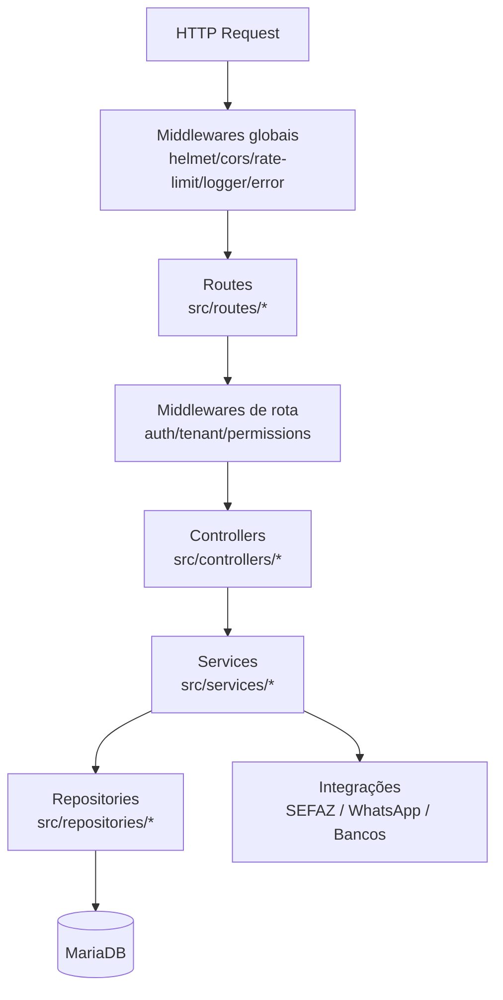

# Arquitetura (PWA + API + Workers) — Keystone ERP

Este documento descreve a arquitetura **de deploy** (Docker Compose) e a arquitetura **interna** (camadas do backend) do projeto.

## Diagrama de Arquitetura (Deploy / Containers)

> Baseado em `docker-compose.yml`, `nginx/default.conf`, `src/app.ts`, `src/server.ts` e `src/worker.ts`.

```mermaid
flowchart LR
  U[Usuário / Navegador] -->|HTTP :80| N[Nginx (container frontend)<br/>Serve /public + proxy]

  N -->|/api/ (ex.: /api/v1/...)| API[Node.js + Express (container backend)<br/>:3000 (Docker)]
  N -->|/uploads/| API
  N -->|/health| API

  API --> DB[(MariaDB<br/>:3306)]

  W[Node.js Worker (container worker)<br/>WhatsApp + SEFAZ polling] --> DB

  W -->|whatsapp-web.js| WA[(WhatsApp Web)]
  API -->|SOAP/mTLS (NFe, etc.)| SEFAZ[(SEFAZ)]
  W -->|SOAP/mTLS (jobs)| SEFAZ
  API -->|REST (ex.: Inter)| BANK[(Bancos/Serviços externos)]

  subgraph Volumes[Volumes Persistentes]
    V1[(uploads_data<br/>/app/public/uploads)]
    V2[(whatsapp_sessions<br/>/app/.runtime)]
    V3[(mariadb_data_prod<br/>/var/lib/mysql)]
  end

  API --- V1
  W --- V1
  W --- V2
  DB --- V3
```

### Containers e Responsabilidades

- **frontend (Nginx)**: serve arquivos estáticos do PWA (HTML/JS/CSS em `public/`) e faz reverse-proxy:
  - `/api/` (inclui `/api/v1/...`) → `backend:3000`
  - `/uploads/` → `backend:3000`
  - `/health` → `backend:3000`
- **backend (Node/Express)**: API REST em `/api/v1/*`, JWT, regras de negócio e acesso ao banco. A porta é definida por `PORT` (no Docker: `3000`; fallback no código: `3030`).
- **worker (Node)**: processamento assíncrono por *polling* de filas no MariaDB:
  - WhatsApp (sessões e envio de mensagens)
  - SEFAZ (consulta/manifestações)
- **db (MariaDB)**: persistência relacional (dados do ERP + tabelas de jobs).

## Diagrama de Arquitetura (Interno do Backend)



## Contexto

O projeto é um sistema Progressivo (PWA) com frontend estático e backend em Node.js/TypeScript, separando a camada visual (Frontend) da camada lógica e conectividade (Backend). A estrutura central está distribuída nas seguintes localizações:

## 📂 Diretórios Centrais

### `/public` (Frontend PWA)

A raiz de tudo que é enxergado pelo usuário e onde o navegador baixa os dados offline.

- **`/public/index.html`** - Tela de login (porta de entrada segura do JWT).
- **`/public/manifest.json`** - O Coração do PWA, informa ao SO de celular/tablet os ícones, tema do sistema e permite instalar como um App.
- **`/public/sw.js`** - *O Service Worker*. O cérebro invisível que cacheia imagens, CSS e HTML permitindo navegação sem internet usando estratégias `Stale-while-Revalidate`.

**Subpastas do Frontend:**

- **`css/`**: Contém o `style.css` (Tailwind processado que define variáveis globais como cores da marca).
- **`js/`**: A Lógica Visual Isolada.
  - *Ex: `sales.js` (Frente de Caixa), `products.js` (Catálogo).*
  - **`api.js`**: O maestro das requisições. Contém os sub-módulos `CacheManager` (salva buscas) e `SyncManager` (enfia vendas em filas quando a internet cai).
  - **`pwa.js`**: Arquivo curto que o navegador bate e chama a instalação global do *Service Worker*.
  - **`components/`**: Peças de montar (como a `navbar.js` que injeta o topo da página sem repetirmos HTML 20 vezes).
- **`pages/`**: A estruturação em HTML cru de cada módulo do sistema (ex: `sales.html`, `dashboard.html`). Mantido 1:1 com os arquivos na aba de JS.

---

### `/src` (Backend - TypeScript & Node.js)

A inteligência do robô, as restrições e conexões seguras.

- **`src/server.ts`** - Entry-point do servidor. Sobe a API na porta definida por `PORT` (em produção via Docker: `3000`; fallback no código: `3030`).
- **`src/controllers/`** - Relembra o garçom. Ele recebe o pedido visual do Front e chama a cozinha (Services).
- **`src/services/`** - Onde o peso de negócio morre. Executa regras como "não pode vender sem preço", grava tudo no banco, manipula os números.
- **`src/routes/`** - Rotas HTTP puras. A placa de trânsito dos endpoints da `/api/v1/`.

---

### `/database` (O Cofre de Informações)

Os alicerces de persistência do ERP, moldados sobre um banco relacional (MariaDB/MySQL) e mantidos via scripts `.sql`.

- Contém os Scripts numerados com sufixo `.sql` *(migrations)*.
- Regem a construção das Tabelas como de Entidades, Controle de Estoque, Lançamento Financeiro, Histórico de Vendas Caixas.
- As chaves primárias são protegidas através de colunas chamadas `public_id` (UUIDs) para não revelar as verdadeiras identidades escalares dos apontamentos da loja.

---

## 🔁 Relacionamento Físico & Rede

1. **Quando Ativo (Online):**
   O `.html` pede um dado HTTP ➔ Aciona o `fetch` encapsulado do `/js/api.js` ➔ Bate em um endpoint HTTP (`/api/v1/...`, via Nginx) ➔ Rotas/Controllers validam permissão e token JWT ➔ Services/Repositories leem/gravam no MariaDB e devolvem a resposta. O Service Worker atualiza o cache de navegabilidade na RAM/Disco do dispositivo.

2. **Quando Operando Sem Rede (Offline PWA):**
   A tela `.html` carrega tranquilamente pois o `/sw.js` já sequestrou ela para o Cache Central na primeira visita da pessoa. O `/js/api.js` acorda e tenta buscar novidades, nota que a internet sumiu e automaticamente responde os dados cruciais através do *CacheManager (Local Storage)*. Novas vendas operadas na frente de caixa, por exemplo, disparam um "POST", que é retido pelo **SyncManager** numa fila invisível.

3. **Retorno Triunfante (Back to Action):**
   Assim que o celular ou sistema percebe o restabelecimento da conectividade de rede, um evento `window.online` sacode o *SyncManager*, que vomita todos os dados guardados em background contra o backend re-escrevendo o banco oficial.
